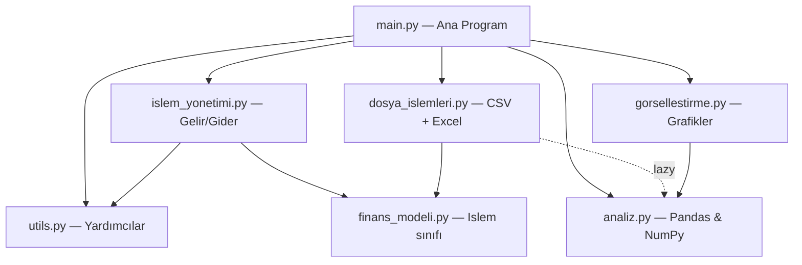
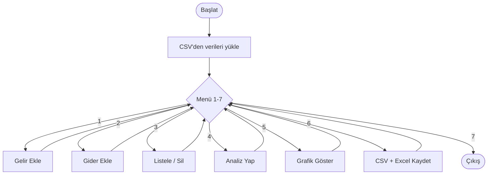
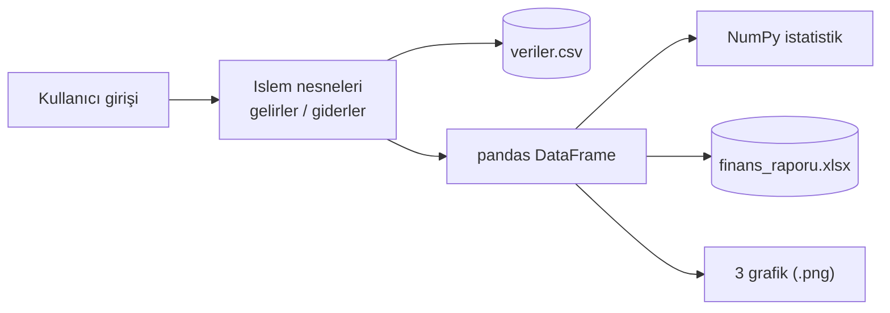
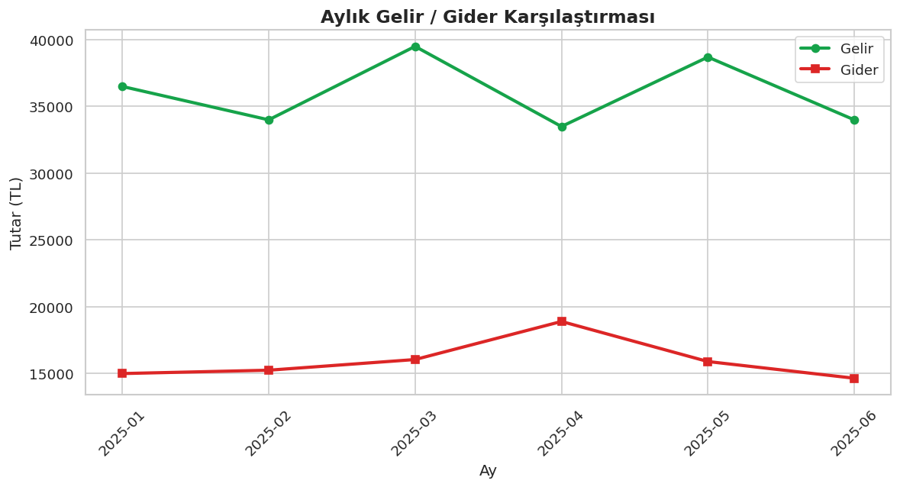
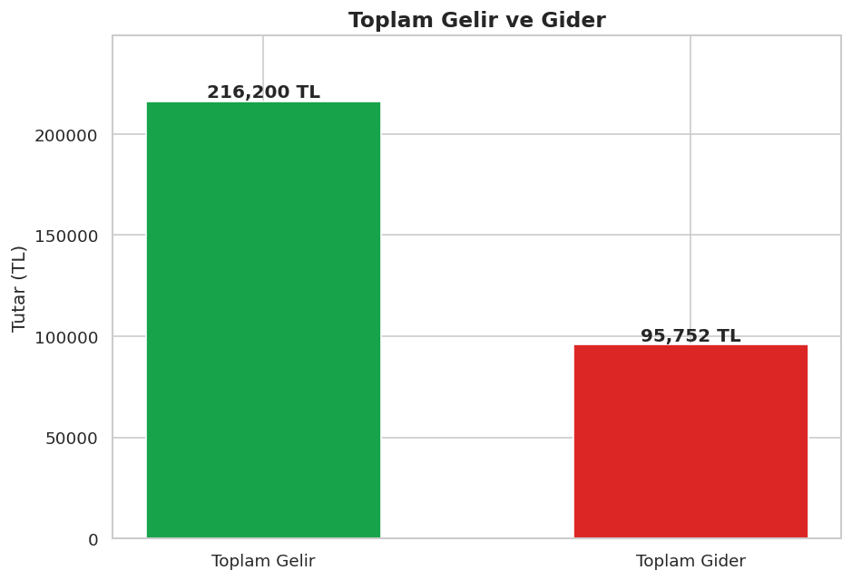
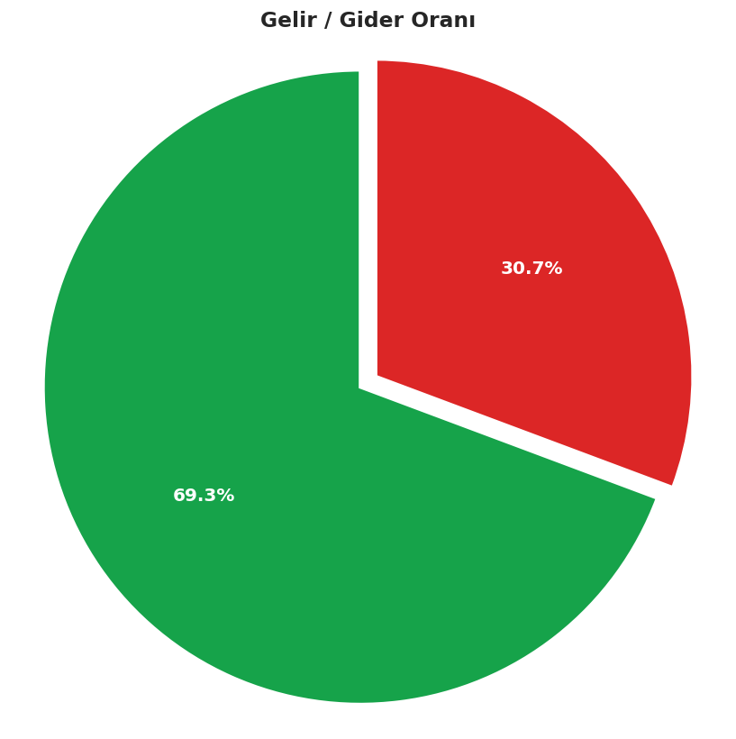

# 💰 Kişisel Finans ve Harcama Takip Sistemi

> **Python Programlama II (BGY210) – Bahar Dönemi Final Projesi**

Bu proje; kullanıcıların gelir ve giderlerini kaydetmesini, listelemesini, analiz
etmesini, grafiklerle görselleştirmesini ve verilerini CSV/Excel dosyalarında
saklamasını sağlayan **modüler**, **nesne tabanlı** ve **veri odaklı** bir
Python uygulamasıdır.

---

🔗 **GitHub Repo:** (https://github.com/muhiddintalha/24083002-BGT-MuhiddinTalhaYilmaz-PythonProje)

🌐 **Canlı Web Arayüzü (GitHub Pages):** (https://muhiddintalha.github.io/24083002-BGT-MuhiddinTalhaYilmaz-PythonProje/)


---

## 📌 Proje Hakkında

Uygulama, dönem boyunca öğrenilen temel ve ileri düzey Python konularını tek bir
gerçek dünya problemi üzerinde birleştirir:

- ✅ Temel Python yapıları (veri tipleri, koşullar, döngüler)
- ✅ Fonksiyonel ve modüler programlama
- ✅ Nesne tabanlı programlama (OOP) — `Islem` sınıfı
- ✅ Dosya işlemleri (CSV okuma/yazma) ve **Excel raporlama**
- ✅ Veri analizi (NumPy & Pandas)
- ✅ Veri görselleştirme (Matplotlib & Seaborn)
- ✅ Hata yönetimi (`try-except`)
- ✅ Konsol uygulaması **ve** ek olarak modern bir web arayüzü
- ✅ Clean Code prensipleri (anlamlı isimler, docstring, açıklayıcı yorumlar)

---

## 🗂️ Proje Yapısı

```
Muhiddin_Talha_Yilmaz_24083002_BGT/
│
├── main.py                  # Ana program (giriş noktası) — tüm modülleri import eder
├── finans_modeli.py         # Islem sınıfı (OOP)
├── islem_yonetimi.py        # Gelir/gider ekleme, listeleme, silme
├── dosya_islemleri.py       # CSV okuma/yazma + Excel raporu
├── analiz.py                # Pandas & NumPy analizleri
├── gorsellestirme.py        # Matplotlib & Seaborn grafikleri
├── utils.py                 # Yardımcı fonksiyonlar (ID, tarih/sayı kontrolü, menü)
├── ornek_cikti_olustur.py   # Örnek verilerle tüm çıktıları otomatik üreten betik
│
├── veriler.csv              # Örnek/kalıcı veri dosyası (çıktı)
├── ciktilar/                # Üretilen çıktılar
│   ├── finans_raporu.xlsx   #   → Çok sayfalı Excel raporu
│   ├── aylik_grafik.png     #   → Aylık gelir/gider çizgi grafiği
│   ├── gelir_gider_bar.png  #   → Toplam gelir/gider sütun grafiği
│   └── pasta_grafik.png     #   → Gelir/gider oranı pasta grafiği
│
├── docs/
│   └── index.html           # Premium (koyu temalı) web arayüzü — GitHub Pages
│
├── requirements.txt         # Gerekli kütüphaneler
├── TESLIM_REHBERI.md        # GitHub + ALMS teslim adımları
└── README.md                # Bu dosya (proje raporu)
```

> ⚠️ **Önemli:** Proje şartname gereği **asla tek dosya** halinde değil, yukarıdaki
> gibi **modüler** biçimde yazılmıştır. `main.py` dosyası diğer tüm modülleri
> `import` ederek bir araya getirir.

---

## 🧩 Modüller ve Görevleri

| Dosya | Açıklama |
|-------|----------|
| `finans_modeli.py` | `Islem` sınıfı (sınıf/nesne yapısı) |
| `islem_yonetimi.py` | Gelir/gider işlemleri (ekle, listele, sil) |
| `dosya_islemleri.py` | CSV okuma/yazma ve Excel dışa aktarma |
| `analiz.py` | Pandas & NumPy ile veri analizi |
| `gorsellestirme.py` | Matplotlib & Seaborn grafikleri |
| `utils.py` | Yardımcı fonksiyonlar |
| `main.py` | Ana menü ve program akışı |

---

## 🔄 Mimari ve Akış Şemaları

### 1) Modül Mimarisi (import ilişkileri)

`main.py` tüm modülleri bir araya getirir; oklar `import` yönünü gösterir.



### 2) Program Akış Şeması (ana menü)



### 3) Veri Akışı



---

## 🏗️ Veri Yapıları

Veriler iki ana liste üzerinde tutulur; **her eleman bir `Islem` nesnesidir:**

```python
gelirler = []   # tip = "gelir" olan Islem nesneleri
giderler = []   # tip = "gider" olan Islem nesneleri
```

### `Islem` Sınıfı (`finans_modeli.py`)

```python
class Islem:
    def __init__(self, id, tutar, tarih, aciklama, tip):
        self.id = id            # int   -> benzersiz kimlik
        self.tutar = tutar      # float -> işlem tutarı
        self.tarih = tarih      # str   -> "YYYY-MM-DD"
        self.aciklama = aciklama# str   -> açıklama
        self.tip = tip          # str   -> "gelir" veya "gider"
```

---

## ⚙️ Zorunlu Fonksiyonlar

**`utils.py`**
- `yeni_id_olustur(liste)` — Listedeki en büyük ID'yi bulup +1 ile benzersiz ID üretir.
- `tarih_kontrol(tarih)` — Tarihin `YYYY-MM-DD` biçiminde olup olmadığını denetler.
- `sayi_kontrol(deger)` — Değerin sayıya çevrilebilir olup olmadığını denetler.
- `menu_goster()` — Ana menüyü ekrana yazdırır.

**`islem_yonetimi.py`**
- `gelir_ekle(gelirler)` — Doğrulanmış yeni bir gelir kaydı oluşturur.
- `gider_ekle(giderler)` — Doğrulanmış yeni bir gider kaydı oluşturur.
- `islemleri_listele(gelirler, giderler)` — Tüm kayıtları düzenli biçimde yazdırır.
- `islem_sil(gelirler, giderler, id)` — ID'ye göre kaydı bulup siler.

**`dosya_islemleri.py`**
- `csv_kaydet(dosya_adi, gelirler, giderler)` — Verileri CSV'ye yazar.
- `csv_oku(dosya_adi)` — CSV'den verileri okuyup listeleri oluşturur.
- `excel_kaydet(dosya_adi, gelirler, giderler)` — Çok sayfalı Excel raporu üretir.

**`analiz.py`**
- `verileri_dataframe_yap(gelirler, giderler)` — Listeleri pandas DataFrame'e çevirir.
- `toplam_gelir_gider(df)` — Toplam gelir ve gideri hesaplar.
- `aylik_analiz(df)` — Aylık bazda özet (gelir/gider/net) çıkarır.
- `numpy_istatistik(df)` — NumPy ile ortalama, min, max, std hesaplar.

**`gorsellestirme.py`**
- `aylik_grafik(df)` — Aylık gelir/gider çizgi grafiği.
- `gelir_gider_bar(df)` — Toplam gelir/gider sütun grafiği.
- `pasta_grafik(df)` — Gelir/gider oranı pasta grafiği.

---

## 🚀 Kurulum ve Çalıştırma

### 1) Gerekli kütüphaneleri kurun

```bash
pip install -r requirements.txt
```

### 2) Konsol uygulamasını başlatın

```bash
python main.py
```

### 3) (İsteğe bağlı) Tüm örnek çıktıları tek seferde üretin

```bash
python ornek_cikti_olustur.py
```

---

## 🖥️ Menü Kullanımı

```
================================================
    KİŞİSEL FİNANS VE HARCAMA TAKİP SİSTEMİ
================================================
  1. Gelir Ekle
  2. Gider Ekle
  3. Listele
  4. Analiz Yap
  5. Grafik Göster
  6. CSV Kaydet
  7. Çıkış
================================================
```

> **Not:** Kayıt silme işlemi, **3. Listele** ekranında listeleme sonrası ID
> girilerek yapılır (`islem_sil` fonksiyonu burada aktif olarak kullanılır).
> **6. CSV Kaydet** seçeneği verileri hem `veriler.csv` dosyasına hem de
> `ciktilar/finans_raporu.xlsx` Excel raporuna yazar.

---

## 📊 Örnek Çıktılar

Aşağıdaki grafikler `ornek_cikti_olustur.py` ile örnek veriler üzerinden üretilmiştir.

### Aylık Gelir / Gider Karşılaştırması


### Toplam Gelir ve Gider


### Gelir / Gider Oranı


Ayrıca tüm veriler ve özet analizler **`ciktilar/finans_raporu.xlsx`** dosyasında
üç ayrı sayfada (Tüm İşlemler, Aylık Özet, İstatistikler) sunulmaktadır.

---


## 🛡️ Hata Yönetimi

Tüm kullanıcı girişleri (tutar, tarih, menü seçimi) doğrulanır ve dosya
işlemleri `try-except` blokları ile korunur. Böylece hatalı girişlerde program
çökmez, kullanıcıya açıklayıcı uyarılar gösterir.

---

## 📜 Lisans

